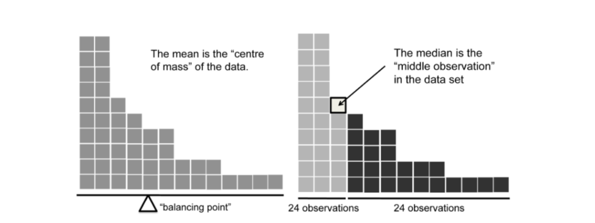

```{r setup, include=FALSE}
options(htmltools.dir.version = FALSE)
```

```{r xaringan-themer, include=FALSE}
library(xaringanthemer)
mono_light(
  code_font_family = "Fira Code",
  code_font_url    = "https://cdn.rawgit.com/tonsky/FiraCode/1.204/distr/fira_code.css"
)
```


---
# Today's class: Descriptive statistics

##Goal is to summarise data in easily understood fashion

##to do:
____________________


```{r load what we need, warning=FALSE, include=FALSE}
#install.packages("lsr")
library(lsr)
library(tidyverse)
library(psych)
load( "aflsmall.Rdata" )

```


???
afl.margins variable contains
the winning margin (number of points) for all 176 home and away games played during the 2010 season.
The afl.finalists variable contains the names of all 400 teams that played in all 200 finals matches
played during the period 1987 to 2010. Let's have a look at the afl.margins variable:

---


```{r}
print(afl.margins)
```

---
##point is that the output isn't very useful. we can't just look at data and figure out what is happening


---
#Central Tendency
______________________

##what is the **middle** of your data?

#1. mean
#2. median
#3. mode

---
# The Mean

### this is the average as we learned in math class. Take all the values and divide  by the total number of values
____________________


N = number of observations
$$X_1=  first observation $$

$$x_{n} = {N}th observation$$


$$\sum$$


$$\sum_{i=1}^{9} X_i$$

"the sum, taken over all i values from 1 to 9, of the value Xi". 

---
mean formula


## $$\overline{X} = \frac{1}{n}  \sum_{i=1}^{N} X_i$$

## maybe  review for many of you, but these symbols are impt later on


---
#how to do mean in R??

## lets say we have 4 values: 34,78,56,35
##the long way

```{r}
(34 + 78 + 56+35)/4
```

---

#or
```{r}
a <- c(34, 78, 56, 35)
sum(a)/length(a)
```

---
#practice

---
# or, just use the mean function!

```{r}
mean(x = a)
mean(a)
#mean
```

look at the help on mean function. how do you deal with missing values?

---
#Median -the middle value of a set of observations


##12,15,19,21,23
---
#Median -the middle value of a set of observations

##the middle value of a set of observations


##12,15,**19**,21,23

----
#what about now?

##12,15,19,20,21,23

---
#again, pretty easy in R

```{r}
print(a)
sort(a)
mean(x =c(35,56))
```


```{r}
median(a)
```

---


###mean = center of gravity
###median = middle value

???
An illustration of the difference between how the mean and the median should be interpreted.
The mean is basically the \centre of gravity" of the data set: if you imagine that the histogram of the
data is a solid object, then the point on which you could balance it (as if on a see-saw) is the mean.
In contrast, the median is the middle observation. Half of the observations are smaller, and half of the
observations are larger.

---
# some tips

##If data are **nominal** then prob not use mean or median
##If data are **ordinal** scale, prob use median. the precise numbers dont matter

##In general, it depends on what you want to  do

#For income, we tend to use the median rather than the mean.
###*why?*

http://www.abc.net.au/news/stories/2010/09/24/3021480.htm

---
#the trimmed mean

##what do you do  with a *messy* dataset?

-100; 2; 3; 4; 5; 6; 7; 8; 9; 10

-15; 2; 3; 4; 5; 6; 7; 8; 9; 12

##what is the mean of  these? 

---
#Problem is the mean is not *robust*; it is highly influenced by extreme values

##trimmed mean discards a percentage of the observations

0% trimmed mean is just the regular mean, and
the 50% trimmed mean is the median.

---
lets practice 

```{r}
dataset <- c( -15,2,3,4,5,6,7,8,9,12 )
```

```{r}
mean(dataset)
median(dataset)
```

#lets try a 10%  trimmed mean

```{r}
mean( x = dataset, trim = .1)
```


---
#mode

##value that occurs most frequently.

```{r}
table( afl.finalists )
```


#which is the mode?

???

```{r}
mode(afl.finalists)
#um, wtf?
```


```{r}
#library(lsr)
modeOf(afl.finalists)
```


---
#central tendency practice 


```{r}

#in base R
mean(diamonds$price)
#in tidyverse
diamonds %>% summarise(mean(price))

```

calcualte the mean and median for all the variables in the diamonds dataset. What is the easiest way to do this

```{r eval=FALSE, include=FALSE}
diamonds %>% summarise_at(vars(carat:z), mean )
```

```{r eval=FALSE, include=FALSE}
diamonds %>% summarise_all(list(min = min, max = max, mean = mean))
```


---
# Measures of Variability
________________________________

##How spread out are the data?

###1. Range - the bigest value minus the smallest
###2. Interquartile range
###3. Mean absolute deviation
###4. Variance
###5. Standard deviation


---
#Interquartile range

##calculates the difference between the 25th quantile & the 75th quantile. fun stats fact: The median is the 50% quantile

```{r}
quantile(afl.margins)
quantile(afl.margins, probs= .5)

```


#how would you get the 25% and 75% 

---

```{r}
IQR(afl.margins)
```

---


background-image: url(https://upload.wikimedia.org/wikipedia/commons/thumb/1/1a/Boxplot_vs_PDF.svg/250px-Boxplot_vs_PDF.svg.png)
background-size: contain

#how to interpert IQR

???

The
simplest way to think about it is like this: the interquartile range is the range spanned by the \middle
half" of the data. That is, one quarter of the data falls below the 25th percentile, one quarter of the
data is above the 75th percentile, leaving the \middle half" of the data lying in between the two. And
the IQR is the range covered by that middle half.

---

background-image: url(http://www-ist.massey.ac.nz/dstirlin/CAST/CAST/Sspread/images/iqrAndHisto.gif)
background-size: contain

#how to interpert IQR
---
#Deviations


##these work by selecting a reference point and report a **typical** deviation from that

---
##Mean absolute deviation - steps:

###1. 56, 31, 56, 8, 32. <- mean = 36.6

###2. calcuate how much each value deviates  from the mean and take the absolute value
      56 - 36.6 = 19.4.
      31- 36.6  = 5.6
      56 - 36.6 = 19.4
      8 - 36.6 = 28.6
      32 - 36.6 = 4.6

###3. then get the mean of these devations. that equals the mean absolute deviation

```{r}
d <- c(19.4,5.6,19.4,28.6,4.6)
mean(d)
```

???
#in 2 weeks we will learn to make a function to do this

---
#Variance

very similar to mean absolute deviation, but instead we square the deviation rather than using the absolute deviation.

## $$s^2$$

## $$var({X}) = \frac{1}{n}  \sum_{i=1}^{N} (X_i - \overline{x})^2$$


---
Find the variance of this dataset first without using the R function....

### 4, 8, 15, 16, 23, 42

???

(sum((set - mean(set))^2))/6


---

```{r}
set <- c(4, 8, 15, 16, 23, 42)
var(set)
```


???
note diff between doing it by hand and using the Var function

n vs. n-1


However, as we'll discuss in Chapter 10, there's a subtle distinction
between \describing a sample" and \making guesses about the population from which the sample came".
Up to this point, it's been a distinction without a dierence. Regardless of whether you're describing a
sample or drawing inferences about the population, the mean is calculated exactly the same way. Not
so for the variance, or the standard deviation, or for many other measures besides. What I outlined to
you initially (i.e., take the actual average, and thus divide by N) assumes that you literally intend to
calculate the variance of the sample. Most of the time, however, you're not terribly interested in the
sample in and of itself. Rather, the sample exists to tell you something about the world. If so, you're
actually starting to move away from calculating a \sample statistic", and towards the idea of estimating
a \population parameter". However, I'm getting ahead of myself. For now, let's just take it on faith
that R knows what it's doing, and we'll revisit the question later on when we talk about estimation in
Chapter 10.

---
#Problems with Variance 

## it isn't easy to interpert. All the numbers are squared..


???

lets say i have the  variance of some measure of how tall a hominin speices was. what is the meaing  of  saying the variance is 256 meters-squared

gibberish units...but useful in mathy terms!
---
#sd

the standard deviation pretty much lets us convert var into meaningful terms
in fact, sometimes it is called the root mean squared deviation RMSD


$$s  = \sqrt{  \frac{1}{n}  \sum_{i=1}^{N} (X_i - \overline{x})^2}$$


???

Because the standard deviation is derived
from the variance, and the variance is a quantity that has little to no meaning that makes sense to us
humans, the standard deviation doesn't have a simple interpretation. As a consequence, most of us just
rely on a simple rule of thumb: in general, you should expect 68% of the data to fall within 1 standard
deviation of the mean, 95% of the data to fall within 2 standard deviation of the mean, and 99.7% of
the data to fall within 3 standard deviations of the mean. This rule tends to work pretty well most
of the time, but it's not exact: it's actually calculated based on an assumption that the histogram is
symmetric and \bell shaped".10 As

---

background-image: url(https://upload.wikimedia.org/wikipedia/commons/thumb/8/8c/Standard_deviation_diagram.svg/1200px-Standard_deviation_diagram.svg.png)
background-size: contain

---

#A *worked* example

lets say you measure the heights of your pets in mm:

pet 1 = 600
pet 2 = 450
pet 3 = 400
pet 4 = 390
pet 5 = 300
pet 6 = 150
What is the mean?

600 + 450 + 400 + 390 +300 / 5

mean = 428

now lets draw it out.
calc var....
 now lets see what R says the var is b = 


---


background-image: url(https://s3.amazonaws.com/libapps/accounts/73082/images/Skeweness.jpg)
background-size: contain


???


???
if the data tend to have a lot of extreme small values (i.e., the lower tail is \longer"
than the upper tail) and not so many extremely large values (left panel), then we say that the data are
negatively skewed. On the other hand, if there are more extremely large values than extremely small ones
(right panel) we say that the data are positively skewed. That's the qualitative idea behind skewness.
The actual formula for the skewness of a data set is as follows


Many textbooks teach a rule of thumb stating that the mean is right of the median under right skew, and left of the median under left skew. This rule fails with surprising frequency. It can fail in multimodal distributions, or in distributions where one tail is long but the other is heavy. Most commonly, though, the rule fails in discrete distributions where the areas to the left and right of the median are not equal. Such distributions not only contradict the textbook relationship between mean, median, and skew, they also contradict the textbook interpretation of the median. We discuss ways to correct ideas about mean, median, and skew, while enhancing the desired intuition.
---


background-image: url(https://i.stack.imgur.com/KBQLN.jpg)
background-size: contain

#Kurtosis - the 'pointeness' of the data


---

---
# R tips

### summary function 

```{r}
summary(diamonds)
```

### describe function
needs the psych package. do you remember how to get a package/

```{r}
#describe(diamonds)
```


---
#Correlations -Describe the relationships between variables in the data.

##covariance 

$$Cov(X,Y)  = \  \frac{1}{n-1}  \sum_{i=1}^{N} (X_i - \overline{X})(Y_i - \overline{Y})$$

if 
#### Cov(X,Y) = 0, then unrealted
#### Cov(X,Y) = +, then positive relationship
#### Cov(X,Y) = -, then negative relationship

But, note what units we are in.....

???
The covariance between two variables X and Y is a generalisation of the notion of the
variance; it's a mathematically simple way of describing the relationship between two variables that isn't
terribly informative to humans:

Because we're multiplying (i.e., taking the \product" of) a quantity that depends on X by a quantity
that depends on Y and then averaging17, you can think of the formula for the covariance as an \average
cross product" between X and Y . The covariance has the nice property that, if X and Y are entirely
unrelated, then the covariance is exactly zero. If the relationship between them is positive (in the
sense shown in Figure 5.9) then the covariance is also positive; and if the relationship is negative then
the covariance is also negative. In other words, the covariance captures the basic qualitative idea of
correlation. Unfortunately, the raw magnitude of the covariance isn't easy to interpret: it depends on
the units in which X and Y are expressed, and worse yet, the actual units that the covariance itself
is expressed in are really weird. For instance, if X refers to the dan.sleep variable (units: hours) and
Y refers to the dan.grump variable (units: grumps), then the units for their covariance are \hours 
grumps". And I have no freaking idea what that would even mean.


---

#Pearson correlation coefficient - *r*
______________________________________

- This *fixes* covaraince by standardizing it.
- Measures the strength of the **linear** relationship between two variables. 

$$r_{xy}  =  \frac{Cov(X,Y)}{\sigma_x \sigma_y}$$

- between -1 (perfect negative relationship) and 1 a perfect positive relationship.

gives a measure of the extent to which the data all tend to
fall on a single, perfectly straight line.

also tells us how knowing one value gives us info on the other value


???

However, because we have two variables that contribute to the covariance, the standardisation
only works if we divide by both standard deviations.18 In other words, the correlation between X and Y
can be written as follows:
rXY 
CovpX; Y q
^X ^Y
By doing this standardisation, not only do we keep all of the nice properties of the covariance discussed
earlier, but the actual values of r are on a meaningful scale: r  1 implies a perfect positive relationship,
and r  1 implies a perfect negative relationship. I'll expand a little more on this point later, in
Section 5.7.5. But before I do, let's look at how to calculate correlations in R

---
#Examples of covariance  in R


```{r}
cov(mtcars)
```

---
#Examples of correlation  in R

```{r}
cor(mtcars)
```


---
#Corrgrams

exploratory visual display and  depicting the patterns of relations among variables 

#need the corrgram package for this

```{r echo=FALSE}
vars2 <- c("Assists","Atbat","Errors","Hits","Homer","logSal",
"Putouts","RBI","Runs","Walks","Years")

corrgram(baseball[,vars2],
lower.panel=panel.shade, upper.panel=panel.pie)


```


--
```{r}
anscombe.1 <- data.frame(x = anscombe[["x1"]], y = anscombe[["y1"]], Set = "Anscombe Set 1")
anscombe.2 <- data.frame(x = anscombe[["x2"]], y = anscombe[["y2"]], Set = "Anscombe Set 2")
anscombe.3 <- data.frame(x = anscombe[["x3"]], y = anscombe[["y3"]], Set = "Anscombe Set 3")
anscombe.4 <- data.frame(x = anscombe[["x4"]], y = anscombe[["y4"]], Set = "Anscombe Set 4")

anscombe.1 %>% ggplot(aes(x=x,y=y)) + geom_point()
anscombe.2 %>% ggplot(aes(x=x,y=y)) + geom_point()
anscombe.3 %>% ggplot(aes(x=x,y=y)) + geom_point()
anscombe.4 %>% ggplot(aes(x=x,y=y)) + geom_point()
```


---

watch hans roling and then...


---


#R practice


